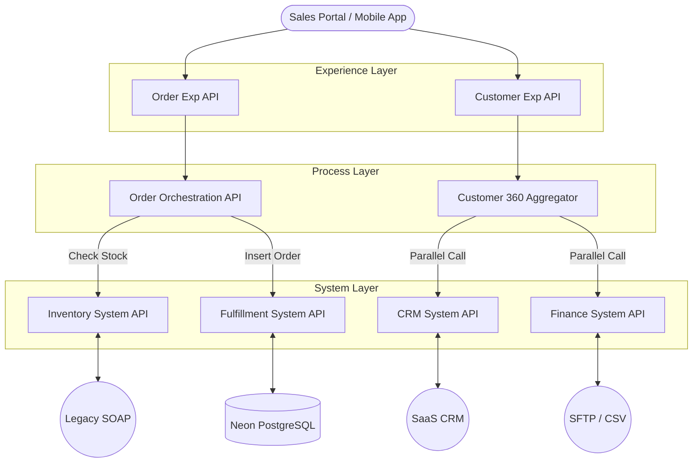

# Enterprise 360° Integration Hub

  

**A full-lifecycle API-Led Connectivity solution orchestrating an Order-to-Fulfillment pipeline.** This project unifies data from **PostgreSQL**, **Legacy SOAP Systems**, **SFTP/CSV**, and **External REST APIs** into a coherent Customer 360° view.

---

## 🏗 Architecture

## 🚀 Key Features

- **Legacy Modernization:** Wraps SOAP XML complexities behind a clean RESTful System API.
- **Reliability:** Implements Dead Letter Queues (DLQ) for zero-data-loss error handling.
- **Orchestration:** Intelligent routing based on real-time inventory stock levels.
- **CI/CD:** Automated build pipeline via GitHub Actions.

---

## 📸 Implementation Evidence

### 1. Legacy System Modernization (SOAP to REST)

**Goal:** Abstract the complexity of the legacy XML-based inventory system.
**Proof:** The screenshot below demonstrates the **Inventory System API** accepting a clean JSON request. Internally, the flow transforms this into a SOAP Envelope, queries the mock legacy backend, and maps the XML response back to simplified JSON.

---

### 2. Financial Data Ingestion (CSV/SFTP)

**Goal:** Automate the digitization of legacy financial records from flat files.
**Proof:** The console log below shows the **Finance System API** detecting a new CSV file in the watched directory, parsing the flat-file structure, and converting it into a standard JSON array for downstream processing.

---

### 3. External CRM Integration (REST & SaaS)

**Goal:** Unify customer profile data from external SaaS platforms using secure API Key authentication.
**Proof:** The screenshot below shows the **CRM System API** proxying a request to an external REST service (reqres.in), injecting the required `x-api-key` header, and transforming the specific vendor response into our canonical "Customer Profile" JSON format.

---

## 🧠 Process Layer (Orchestration)

### 1. Smart Order Routing

**Goal:** Implement business logic to prevent orders for out-of-stock items.
**Logic:** The **Process API** orchestrates calls between the Inventory System and the Fulfillment Database. It uses a **Choice Router** to make real-time decisions:

- **Path A (In Stock):** Proceed to insert order into PostgreSQL.
- **Path B (Out of Stock):** Immediately reject order with HTTP 409 Conflict.

---

### 2. Logic Validation (Negative Testing)

**Goal:** Ensure the system correctly rejects orders when inventory is unavailable.
**Proof:** By sending a specific product ID (`P-999`), the system simulates an "Out of Stock" scenario. The Process API correctly catches this state and returns a **409 Conflict** status, preventing the database insertion.

---

### 3. Customer 360 Aggregation (Scatter-Gather)

**Goal:** Reduce API latency by fetching data from multiple systems in parallel.
**Logic:** The **Customer Process API** uses a **Scatter-Gather** router to simultaneously call the external CRM and the internal Finance History system. It aggregates the responses into a unified profile 2x faster than sequential calls.

---

## 📉 Agile Delivery Methodology

This project followed a strict **Agile Scrum** methodology managed via JIRA.

- **Sprints:** 2-week delivery cycles.
- **Epics:** Grouped by Architectural Layer (System, Process, Experience).
- **Stories:** Defined with clear Acceptance Criteria and Gherkin syntax.

